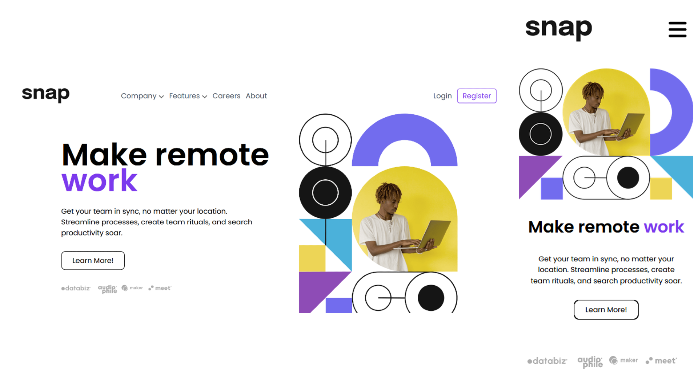
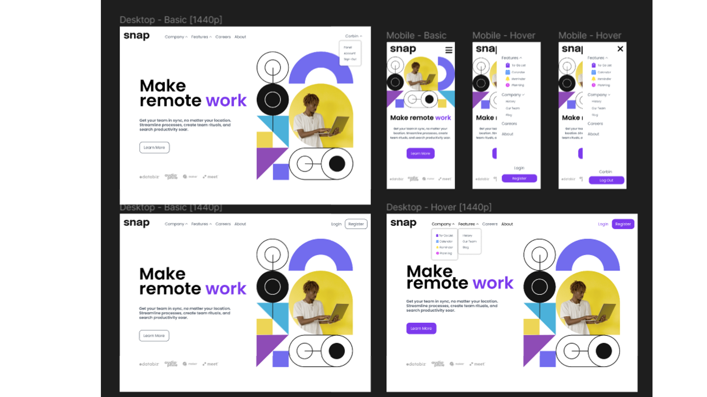

# ***Snap* Front Page Responsive Design**

## **Overview**
 This project represents my inaugural journey into developing a fully responsive front page from scratch. Snap is a conceptual service designed to enhance the fluidity and efficiency of remote teamwork for companies and teams. The challenge of creating this front page was an enlightening experience, pushing my web design skills to new heights.
 
 *Credit for the originaly project design goes to Frontend Mentor. View the project page here*
 ## **Project Features**
 - **Responsive Design:** Designed to provide (ideally) an optimal viewing experience across a wide range of platforms
 - **Navigation Bar:** Includes dropdown menus for enhanced user navigation, meticulously crafted to integrate seamlessly with both desktop and mobile layouts. If this was a genuine website, this would be injected into every page.
 - **Login and Sign-Up Features:** These buttons are strategically located to offer users quick and easy access to authentication services, seamlessly highlighting the website's capability to support user registration and sign-in.
 - **Hero Section:** Showcases the hero headline with a compelling combination of imagery and text to hook the targetted user.
 - **Partnership Logos:** Highlights the collaboration with reputed companies, enhancing the service's credibility.
 
---

## **Development Approach**
Without the use of a premade Figma file, this project was an exercise in creativity and skill enhancement. Despite having access to Frontend-Mentor's resources, with the exception of the stock images, I chose to design the website independently to hone my skills in web design, particularly focusing on:
- **Crafted with Precision:** While the original design concept was not my own, I meticulously reconstructed it in Figma, enabling a thoughtful pre-development phase where colors, font sizes, and spacing were meticulously planned. This deliberate approach in a versatile design tool set the foundation for a seamless transition into HTML development.
- **SVG Icons**: Sourcing and customizing the SVG icons to fit the aesthetic and functional needs of the site.
- **Responsive Layouts:** Devoloping skills for Figma's *auto layout* utility, I was able to learn how to ensure the website's adaptability across different devices.
>Feel free to grab the figma file and check it out yourself!
# **Challenges and Learning Outcomes**
The journey through this project was marked by significant learning milestones:

- **Navigation Bar Complexity:** Mastering dropdown menus was a challenge that taught me the intricacies of `position: absolute` and CSS *hover* utility.
- **Image Integration:** The hero section posed challenges in image scaling and responsiveness, leading to valuable lessons in CSS and HTML practices.

---
# Concluding Thoughts
The development of the Snap front page has been a journey of growth, resilience, and learning. It stands as a testament to the power of perseverance through unexpected challenges, including personal adversities. This project not only enhanced my technical skills in web design but also reinforced my commitment to continuous learning and problem-solving.

